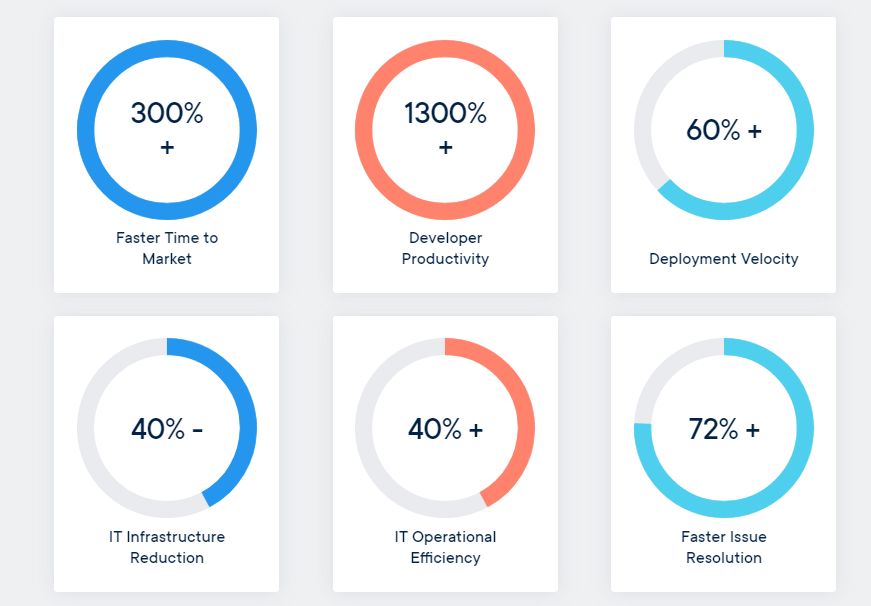
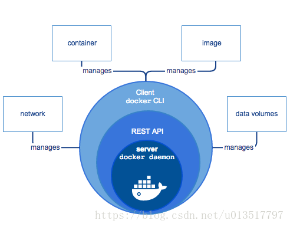
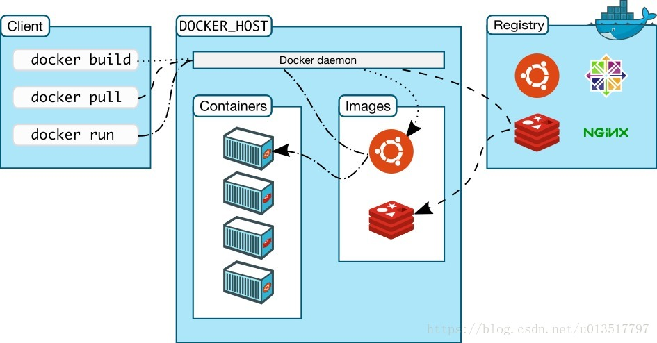
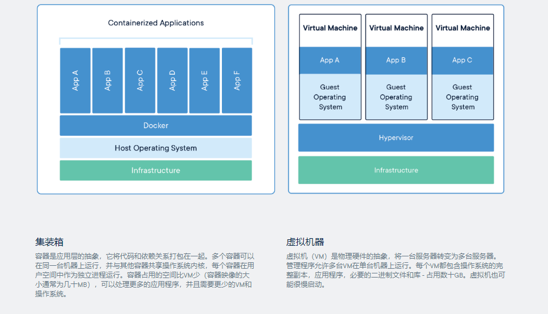

# 概要

**掌握程度**

 - 掌握Docker核心概念
-  熟悉Docker工作原理
-  独立使用Docker部署应用程序
-  接入CI/CD，实现环境标准化


**目录**

 1. [概述](#summary)
	 - [什么是DOCKER](#what_docekr)
 	 - [设计目标](#design_goal)
	 - [基本组成](#basic_composition)
	 - [容器 VS 虚拟机](#docker_vs_virtual)
	 - [应用场景](#application_scenario)
2. [安装](#install)	
	- [版本](#docker_version)
	- [支持平台](#support_platform)
	- [centos7 yum安装](#yum_install)
	- [centos7 二进制安装](#source_code_install)

	
	
#### <span id="summary">一 、 概述</span>

##### <span id="what_docekr">什么是DOCKER？</span>


> [官方文档](https://www.docker.com/resources/what-container) 
>
>  - 使用最广泛的开源容器引擎
>  - 一种操作系统级的虚拟化技术
>  - 依赖于Linux内核特性：Namespace（资源隔离）和Cgroups（资源限制）
>   - 一个简单的应用程序打包工具

 ##### <span id="design_goal">设计目标</span>

> [官方文档](https://www.docker.com/resources/what-container) 
>
>  

 ##### <span id="basic_composition">基本组成</span>

>  
>  - Docker Client：客户端
> - Ddocker Daemon：守护进程
> - Docker Images：镜像
> - Docker Container：容器
> - Docker Registry：镜像仓库
> 

 ##### <span id="docker_vs_virtual">容器 VS 虚拟机</span>

> [官方文档](https://www.docker.com/resources/what-container) 
> 

|     |  Container    |   VM   |
| --- | --- | --- |
|   启动速度  | 秒级    |  分钟级    |
|    运行性能  | 接近原生    |  5%左右损失   |
|   磁盘占用  |  MB   |   GB	  |
|  隔离性   |  进程级别   |  系统级（更彻底）   |
|  操作系统   |  只支持Linux   | 几乎所有    |
|  封装程度   |  只打包项目代码和依赖关系，共享宿主机内核   | 完整的操作系统    |

 ##### <span id="application_scenario">应用场景</span>

 
 > 1. 应用程序打包和发布
 > 2. 应用程序隔离
 > 3. 持续集成
 > 4. 部署微服务
 > 5. 快速搭建测试环境
 > 6. 提供PaaS产品


#### <span id="install">二 、 安装</span>
##### <span id="docker_version">版本</span>
> - 社区版（Community Edition，CE）
> - 企业版（Enterprise Edition，EE）
##### <span id="support_platform">支持平台</span>
> -  Linux（CentOS,Debian,Fedora,Oracle Linux,RHEL,SUSE和Ubuntu）
> -  Mac
> -  Windows( 新一代的window for docker 只支持 window10专业版 )
##### <span id="yum_install">centos7 yum安装</span>
> [官方文档](https://docs.docker.com) 
``` shell
	# 安装依赖包
	yum install -y yum-utils device-mapper-persistent-data lvm2
	# 添加Docker软件包源
	yum-config-manager \
	--add-repo \
	https://download.docker.com/linux/centos/docker-ce.repo
	# 安装Docker CE
	yum install -y docker-ce
	# 启动Docker服务并设置开机启动
	systemctl start docker
	systemctl enable docker
```
##### <span id="source_code_install">centos7 二进制安装</span>
> [官方文档](https://docs.docker.com/install/linux/docker-ce/binaries/) 
> 二进制安装条件：
> - A 64-bit installation
> - Version 3.10 or higher of the Linux kernel. The latest version of the kernel available for your platform is recommended.
> - iptables version 1.4 or higher
> - git version 1.7 or higher
> - A ps executable, usually provided by procps or a similar package.
> - XZ Utils 4.9 or higher
> - A properly mounted cgroupfs hierarchy; a single, all-encompassing cgroup mount point is not sufficient. See Github issues [#2683](https://github.com/moby/moby/issues/2683), [#3485](https://github.com/moby/moby/issues/3485), [#4568](https://github.com/moby/moby/issues/4568)).
``` shell
	# 下载
	wget -P /root  https://download.docker.com/linux/static/stable/x86_64/docker-18.06.3-ce.tgz 
	
```